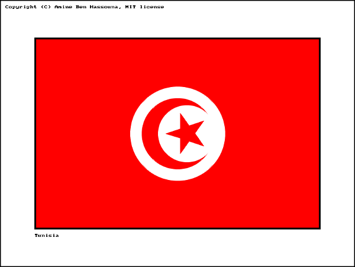

# Basic C SDL2 project : Tunisia flag

This project is a basic C [SDL2][SDL] project that uses [CMake][] as a build system.<br>
It draws the flag of [Tunisia][] using basic graphics primitives.



It could be used as a base to draw any other flag with SDL2. Just fork it,
clone it and execute the `rename_project.sh` script. You will be prompted to
enter the new project name, the new executable name and the new git repository,
but you can keep the autodetected values. Finally, just commit and push the
result to your repository.

## Dependencies

- [Git][]
- C Compiler (gcc, ...)
- [CMake][]
- [SDL2][SDL] library
- [SDL2_gfx][] library

**On Debian/Ubuntu based distributions, use the following command:**

```sh
sudo apt install git build-essential pkg-config cmake cmake-data libsdl2-dev libsdl2-gfx-dev
```

**Optional packages:**

- [SDL2_image][] library
- [SDL2_ttf][] library
- [SDL2_net][] library
- [SDL2_mixer][] library

```sh
sudo apt install libsdl2-image-dev libsdl2-ttf-dev libsdl2-net-dev libsdl2-mixer-dev
```

## Build instructions

```sh
# Clone this repo
git clone https://gitlab.com/aminosbh/basic-c-sdl-project-tunisia-flag.git
cd basic-c-sdl-project-tunisia-flag

# Create a build folder
mkdir build
cd build

# Build
cmake ..
make

# Run
./basic-c-sdl-project-tunisia-flag
```

***Note:*** To use SDL2_image, SDL2_ttf, SDL2_net or SDL2_mixer, you should
uncomment some instructions in the CMakeLists.txt file and re-execute the
`make` command.

### Open the project with an IDE under Linux

See [IDE_USAGE.md](IDE_USAGE.md) for details.

## License

Author: Amine B. Hassouna [@aminosbh](https://gitlab.com/aminosbh)

This project is distributed under the terms of the MIT license
[&lt;LICENSE&gt;](LICENSE).


[SDL]: https://www.libsdl.org
[CMake]: https://cmake.org
[Git]: https://git-scm.com
[SDL2_image]: https://www.libsdl.org/projects/SDL_image
[SDL2_ttf]: https://www.libsdl.org/projects/SDL_ttf
[SDL2_net]: https://www.libsdl.org/projects/SDL_net
[SDL2_mixer]: https://www.libsdl.org/projects/SDL_mixer
[SDL2_gfx]: http://www.ferzkopp.net/wordpress/2016/01/02/sdl_gfx-sdl2_gfx
[Tunisia]: https://en.wikipedia.org/wiki/Tunisia
